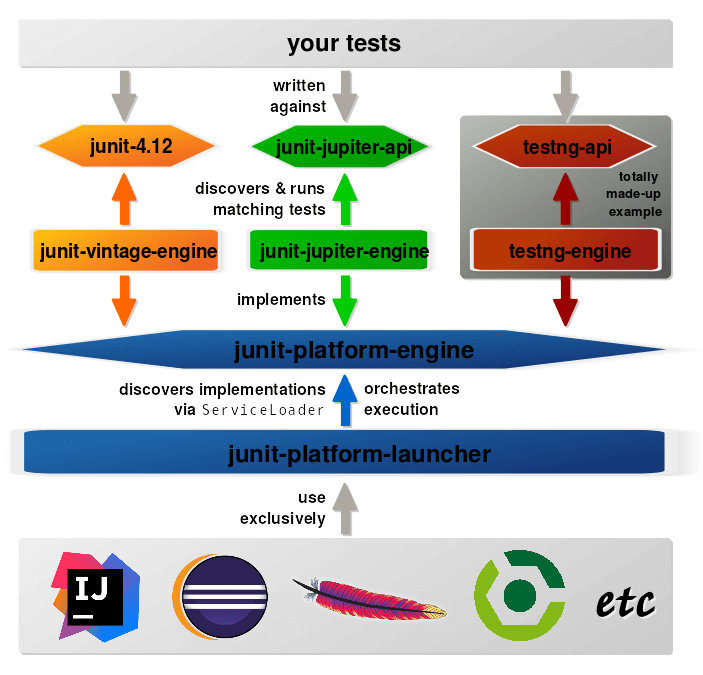

# JUnit 5
[JUnit](https://junit.org/junit5/) is a unit testing framework for the Java programming language 
that plays a big role in regression testing. An open-source framework, it is used to write 
and run repeatable automated tests.
JDK 8 brought very exciting features in java and most notably 
[lambda expressions](https://docs.oracle.com/javase/tutorial/java/javaOO/lambdaexpressions.html). 

JUnit 5 aims to adapt java 8 style of coding and several other features as well, 
that’s why java 8 is required to create and execute tests in JUnit 5.

##Prerequisites
JUnit 5 requires Java 8 (or higher) at runtime. However, you can still test code that has been 
compiled with previous versions of the JDK.

## JUnit 5 Architecture
JUnit 5 is composed of several different modules from three different sub-projects:

``` 
JUnit 5 = JUnit Platform + JUnit Jupiter + JUnit Vintage 
```


### JUnit Platform

Its main responsibility is to launch the testing frameworks on the JVM. 
As you see in the architecture diagram it is an interface between build tools, tests, IDE and JUnit.
 It also defines TestEngine API to create a testing framework which operates on JUnit platform 
 and in this way we can use external libraries in JUnit ecosystem by implementing custom engines.


### JUnit Jupiter ```junit-jupiter-api```

This is the new extension and building block of JUnit. It comprises new extensions and 
libraries for JUnit 5. The new annotations of the JUnit 5 are summarized as follows:

   * ```@BeforeAll```: Annotated method runs before all test methods in the current class.
   * ```@AfterAll```: Annotated method runs after all test methods in the current class.
   * ```@BeforeEach```: Annotated method runs before each test method.
   * ```@AfterEach```: Annotated method runs after each test method.
   * ```@Disable```: Disables a test class or a method.
   * ```@Tag```: We can tag the tests methods such as Smoke, Regression, Critical, etc.
   * ```@Nested```: Annotated class is a nested, non-static test class.
   * ```@DisplayName```: We can declare a custom display name for a test class or a test method.
   * ```@ExtendWith```: it is used to register custom extensions
   * ```@TestFactory```: Declares that the method that is a test factory method for dynamic testıng.

### JUnit Vintage

It is a supporting library for JUnit 5. By using Junit Vintage we can also run JUnit 3 
and JUnit 4 based tests on the JUnit 5 platform.



### junit-jupiter-api

The API against which developers write tests. Contains all the annotations, assertions, etc. 
that we saw when we discussed JUnit 5’s basics.

### junit-jupiter-engine 

An implementation of the ``junit-platform-engine``` API that runs JUnit 5 tests.

### junit-vintage-engine

An implementation of the junit-platform-engine API that runs tests written with JUnit 3 or 4. 
Here, the JUnit 4 artifact junit-4.12 acts as the API the developer implements its tests against 
```junit-jupiter-api``` but also contains the main functionality of how to run the tests.
The engine could be seen as an adapter of JUnit 3/4 for version 5.

### junit-platform-engine

The API all test engines have to implement, so they are accessible in a uniform way. 
Engines might run typical JUnit tests but alternatively implementations could run tests written
 with TestNG, Spock, Cucumber, etc.

### junit-platform-launcher
Uses the ServiceLoader to discover test engine implementations and to orchestrate their execution. 
It provides an API to IDEs and build tools so they can interact with test execution, 
e.g. by launching individual tests and showing their results.

Now after understanding the architecture, lets begin with the setup process [JUnit 5 Setup](JUnit4toJUnit5.md)