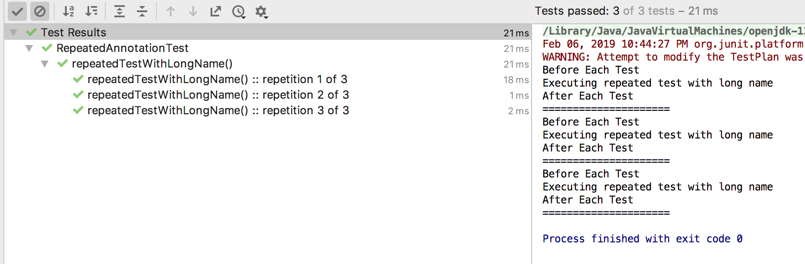
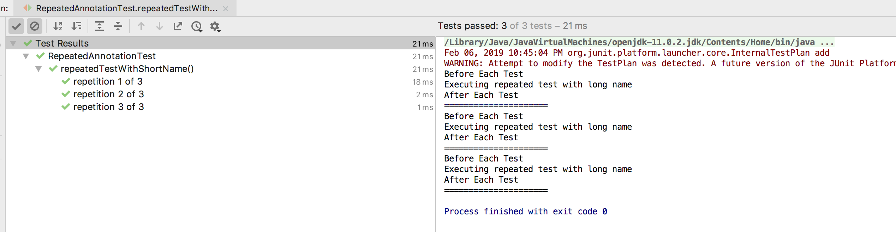
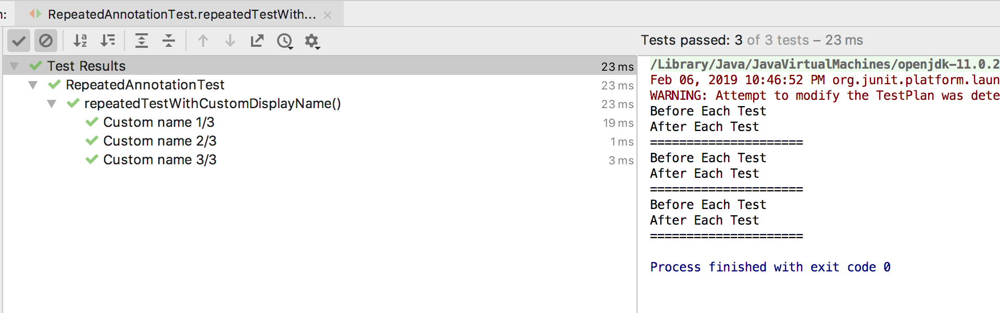
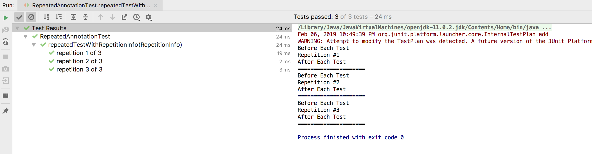

# @JUnit 5 Annotations

In this section we will see the basic JUnit 5 annotations. If you are familier with JUnit 4, 
here you can notice some of the annotations changed in JUnit 5.

All the core annotations are located in ```org.junit.jupiter.api``` package in the ```junit-jupiter-api```.

### Basic annotations

  | Annotation  | Description|
  | ------------- | ------------- |
  | **@Test**  | This annotation denotes that a method is a test method. Unlike JUnit 4’s @Test annotation, this annotation does not declare any attributes.  |
  | **@DisplayName**  | Declares a custom display name for the test class or test method.   |
  | **@BeforeEach** | Denotes that the annotated method should be executed before each test. Exactly same as JUnit 4’s **@Before**.|
  | **@AfterEach** | Denotes that the annotated method should be executed after each test. Exactly same as JUnit 4’s **@After**.|
  | **@BeforeAll** | Denotes that the annotated method should be executed before all test methods in the current class. Exactly same as JUnit 4’s **@BeforeClass**. Such methods must be **static** (unless the “per-class” test instance lifecycle is used). |
  | **@AfterAll** | Denotes that the annotated method should be executed after all @Test, @RepeatedTest, @ParameterizedTest, and @TestFactory methods in the current class; analogous to JUnit 4’s **@AfterClass**. It must be static (unless the “per-class” test instance lifecycle is used).
  
   
In this section we will look at some special annotations like: @DisplayName, @RepeatedTest, @ParameterizedTest, @TestFactory, @TestTemplate.


## **@DisplayNames**

Test classes and test methods can declare custom display names — with spaces, special characters, 
and even emojis — that will be displayed by test runners and test reporting.


## **@Disabled**
Entire test classes or individual test methods may be disabled via the **```@Disabled```** annotation.
Junit 4 had ```@Ignore``` annotation.


Based on these basic annotations, lets see one running example: [LifecycleJUnit5Test.java](examples/LifecycleJUnit5Test.java)


## **@RepeatedTest**
@RepeatedTest annotation introduced in JUnit 5. It provides us a powerful way to write any test that we want to 
repeat several times.

Unit 5 now allows defining parameters for test constructors and methods and enables
 dependency injection for them. This mechanism works by using an instance of a ParameterResolver
  to dynamically resolve parameters at runtime.
  
  Currently, there are only 3 built-in resolvers for parameters of 
  type **TestInfo**, **RepetitionInfo** and **TestReporter**.

``` java 
@RepeatedTest(3)
void repeatedTest(TestInfo testInfo) {
    System.out.println("Executing repeated test");
  
    assertEquals(2, Math.addExact(1, 1), "1 + 1 should equal 2");
 }
```

The **above test will be executed three times** as if the same test was written three times.

### **Lifecycle Support for @RepeatedTest**
**Each execution of the @RepeatedTest will behave like a regular @Test** having full 
JUnit test life cycle support. Meaning that, during each execution, the @BeforeEach and @AfterEach methods will be called. 
To demonstrate this, just add the appropriate methods in the test class:

Check [code example](annotations/examples/RepeatedAnnotationTest.java)

## Configuring the Test Name
Identifiers can be configured further using the name attribute:

``` java
@RepeatedTest(value = 3, name = RepeatedTest.LONG_DISPLAY_NAME)
void repeatedTestWithLongName() {
    System.out.println("Executing repeated test with long name");
  
    assertEquals(2, Math.addExact(1, 1), "1 + 1 should equal 2");
}
```



Another option is to use RepeatedTest.SHORT_DISPLAY_NAME which will produce the short name of the test:



If however, we need to use our customized name, it is very much possible:

``` java
@RepeatedTest(value = 3, name = "Custom name {currentRepetition}/{totalRepetitions}")
void repeatedTestWithCustomDisplayName(TestInfo testInfo) {
    assertEquals(2, Math.addExact(1, 1), "1 + 1 should equal 2");
}
```

The ***{currentRepetition}*** and ***{totalRepetitions}*** are the placeholders for the current repetition and 
the total number of repetitions. These values are automatically provided by JUnit at the runtime, 
and no additional configuration is required. The output is pretty much what we expected:




## Accessing the RepetitionInfo

Apart from the name attribute, JUnit provides access to the repetition metadata in our test code as well. 
This is achieved by adding a RepetitionInfo parameter to our test method:

``` java
@RepeatedTest(3)
void repeatedTestWithRepetitionInfo(RepetitionInfo repetitionInfo) {
    System.out.println("Repetition #" + repetitionInfo.getCurrentRepetition());
  
    assertEquals(3, repetitionInfo.getTotalRepetitions());
}

```



Lets move next to [ParameterizedTest](ParameterizedTest.md)
