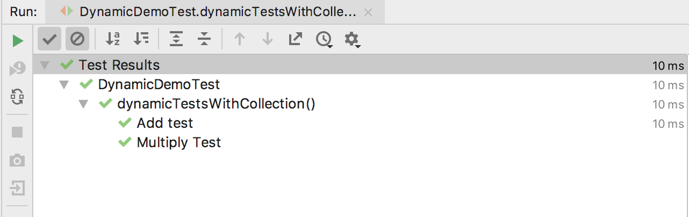
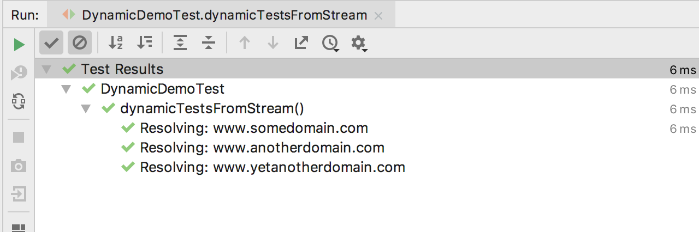

# Dynamic Tests in JUnit 5

Dynamic testing is a new programming model introduced in JUnit 5. 
In this section, we’ll have a look at what exactly dynamic tests are and how to create them.

## What is a DynamicTest?
The standard tests annotated with @Test annotation are static tests which are fully specified at the compile time. 

A DynamicTest is a test generated during runtime. 
These tests are generated by a factory method annotated with the **``` @TestFactory```**  annotation.

  * A ``` @TestFactory``` method must return a Stream, Collection, Iterable, or Iterator of DynamicTest instances. 
  * Returning anything else will result in a ```JUnitException ``` since the invalid return types cannot be detected at
   compile time. 
  * Apart from this, a **``` @TestFactory```**  method ***cannot*** be ***static*** or ***private***.
    
  * The DynamicTests are executed differently than the standard @Tests and do not support lifecycle callbacks.
   Meaning, the ``` @BeforeEach``` and  ```@AfterEach ``` methods will not be called for the DynamicTests.
 
## Creating DynamicTests
First, let’s have a look at different ways of creating *DynamicTests*.

The examples here are not dynamic in nature, but they’ll provide a good starting point for creating truly dynamic ones.

We’re going to create a Collection of *DynamicTest*:

```
 @TestFactory
    Collection<DynamicTest> dynamicTestsWithCollection() {
        return Arrays.asList(
                DynamicTest.dynamicTest("Add test",
                        () -> assertEquals(2, Math.addExact(1, 1))),
                DynamicTest.dynamicTest("Multiply Test",
                        () -> assertEquals(4, Math.multiplyExact(2, 2))));
    }
    
```

  * The *@TestFactory* method tells JUnit that this is a factory for creating dynamic tests.

  * We’re only returning a Collection of DynamicTest.  
  
  * Each of the DynamicTest consists of two parts, the name of the test or the display name, and an Executable.
  
  The output will contain the display name that we passed to the dynamic tests:
  
  
  
  The same test can be modified to return an Iterable, Iterator, or a Stream:
  
  ```
      @TestFactory
      Iterable<DynamicTest> dynamicTestsWithIterable() {
          return Arrays.asList(
                  DynamicTest.dynamicTest("Add test",
                          () -> assertEquals(2, Math.addExact(1, 1))),
                  DynamicTest.dynamicTest("Multiply Test",
                          () -> assertEquals(4, Math.multiplyExact(2, 2))));
      }
  
      @TestFactory
      Iterator<DynamicTest> dynamicTestsWithIterator() {
          return Arrays.asList(
                  DynamicTest.dynamicTest("Add test",
                          () -> assertEquals(2, Math.addExact(1, 1))),
                  DynamicTest.dynamicTest("Multiply Test",
                          () -> assertEquals(4, Math.multiplyExact(2, 2))))
                  .iterator();
      }
  
      @TestFactory
      Stream<DynamicTest> dynamicTestsFromIntStream() {
          return IntStream.iterate(0, n -> n + 2)
                  .limit(10)
                  .mapToObj(n -> DynamicTest.dynamicTest("test" + n, () -> assertTrue(n % 2 == 0)));
      }

  ```
  [**Code**](annotations/examples/DynamicDemoTest.java)
  
  ## Creating a Stream of DynamicTests
  
  ```
  @TestFactory
      Stream<DynamicTest> dynamicTestsFromStream() {
  
          // sample input and output
          List<String> inputList = Arrays.asList("www.somedomain.com", "www.anotherdomain.com", "www.yetanotherdomain.com");
          List<String> outputList = Arrays.asList("154.174.10.56", "211.152.104.132", "178.144.120.156");
  
          // input generator that generates inputs using inputList
          Iterator<String> inputGenerator = inputList.iterator();
  
          // a display name generator that creates a different name based on the input
          Function<String, String> displayNameGenerator = (input) -> "Resolving: " + input;
  
          // the test executor, which actually has the logic of how to execute the test case
          DomainNameResolver resolver = new DomainNameResolver();
          ThrowingConsumer<String> testExecutor = (input) -> {
              int id = inputList.indexOf(input);
              assertEquals(outputList.get(id), resolver.resolveDomain(input));
          };
  
          // combine everything and return a Stream of DynamicTest
          return DynamicTest.stream(inputGenerator, displayNameGenerator, testExecutor);
      }
  
      class DomainNameResolver {
  
          private Map<String, String> ipByDomainName = new HashMap<>();
  
          DomainNameResolver() {
              this.ipByDomainName.put("www.somedomain.com", "154.174.10.56");
              this.ipByDomainName.put("www.anotherdomain.com", "211.152.104.132");
              this.ipByDomainName.put("www.yetanotherdomain.com", "178.144.120.156");
          }
  
          public String resolveDomain(String domainName) {
              return ipByDomainName.get(domainName);
          }
      }
      
  ```
   **input generator:**
  ```Iterator<String> inputGenerator = inputList.iterator(); ``` 
  
  The input generator is nothing but an Iterator of String. 
  It uses our inputList and returns the domain name one by one.
  
  The display name generator is fairly simple:
  
  ``` Function<String, String> displayNameGenerator = (input) -> "Resolving: " + input; ```
  
  The task of a display name generator is just to provide a display name for the test case that will be used in 
  JUnit reports or the JUnit tab of our IDE.
  
  ```
      DomainNameResolver resolver = new DomainNameResolver();
            ThrowingConsumer<String> testExecutor = (input) -> {
                int id = inputList.indexOf(input);
                assertEquals(outputList.get(id), resolver.resolveDomain(input));
            };
  ```
  We have used the ThrowingConsumer, which is a @FunctionalInterface for writing the test case. 
  For each input generated by the data generator, we’re fetching the expected output from 
  the outputList and the actual output from an instance of DomainNameResolver.
  
  Now the last part is simply to assemble all the pieces and return as a Stream of DynamicTest:
  ``` return DynamicTest.stream(
        inputGenerator, displayNameGenerator, testExecutor);
  ```
   
  
  
  ```
  @TestFactory
  Stream<DynamicTest> dynamicTestsForEmployeeWorkflows() {
      List<Employee> inputList = Arrays.asList(
        new Employee(1, "Fred"), new Employee(2), new Employee(3, "John"));
           
      EmployeeDao dao = new EmployeeDao();
      Stream<DynamicTest> saveEmployeeStream = inputList.stream()
        .map(emp -> DynamicTest.dynamicTest(
          "saveEmployee: " + emp.toString(), 
            () -> {
                Employee returned = dao.save(emp.getId());
                assertEquals(returned.getId(), emp.getId());
            }
      ));
           
      Stream<DynamicTest> saveEmployeeWithFirstNameStream 
        = inputList.stream()
        .filter(emp -> !emp.getFirstName().isEmpty())
        .map(emp -> DynamicTest.dynamicTest(
          "saveEmployeeWithName" + emp.toString(), 
          () -> {
              Employee returned = dao.save(emp.getId(), emp.getFirstName());
              assertEquals(returned.getId(), emp.getId());
              assertEquals(returned.getFirstName(), emp.getFirstName());
          }));
           
      return Stream.concat(saveEmployeeStream, 
        saveEmployeeWithFirstNameStream);
  }
  
  ```
  
  Lets move to [Nested Tests](NestedTests.md)