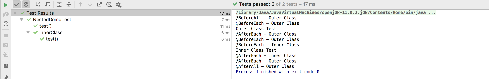
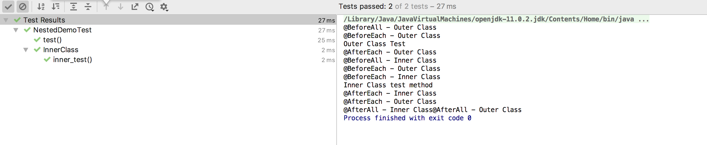

# Nested Tests

JUnit Jupiter **``` @Nested ```** annotation can be used to mark a nested class to be included in the test cases. 
When JUnit tests are executed, Nested classes are not scanned for test methods.
We can explicitly mark them to be scanned for test cases using **@Nested** annotation.
 
JUnit Nested test classes should be non-static.

```
@BeforeAll
    static void setUpBeforeClass() throws Exception {
        System.out.println("@BeforeAll - Outer Class");
    }

    @AfterAll
    static void tearDownAfterClass() throws Exception {
        System.out.println("@AfterAll - Outer Class");
    }

    @BeforeEach
    void setUp() throws Exception {
        System.out.println("@BeforeEach - Outer Class");
    }

    @AfterEach
    void tearDown() throws Exception {
        System.out.println("@AfterEach - Outer Class");
    }

    @Test
    void test() {
        System.out.println("Outer Class Test");
    }

    @Nested
    class InnerClass {
        @BeforeEach
        void setUp() throws Exception {
            System.out.println("@BeforeEach - Inner Class");
        }

        @AfterEach
        void tearDown() throws Exception {
            System.out.println("@AfterEach - Inner Class");
        }

        @Test
        void test() {
            System.out.println("Inner Class Test");
        }
    }
```



If we want @BeforeAll and @AfterAll methods in the nested test class,
 then we have to explicitly set its **lifecycle behavior to “per-class”**. 

The default behavior of JUnit test cases is “per-method”.

```
    @Nested
	@TestInstance(Lifecycle.PER_CLASS)
	class InnerClass {
		@BeforeAll
		void setUpBeforeClassInner() throws Exception {
			System.out.println("@BeforeAll - Inner Class");
		}

		@AfterAll
		void tearDownAfterClassInner() throws Exception {
			System.out.println("@AfterAll - Inner Class");
		}

		@BeforeEach
		void setUp() throws Exception {
			System.out.println("@BeforeEach - Inner Class");
		}

		@AfterEach
		void tearDown() throws Exception {
			System.out.println("@AfterEach - Inner Class");
		}

		@Test
		void inner_test() {
			System.out.println("Inner Class test method");
		}
	}
	
```

