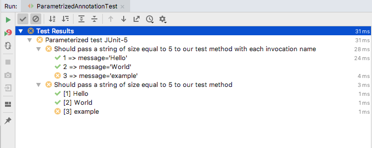
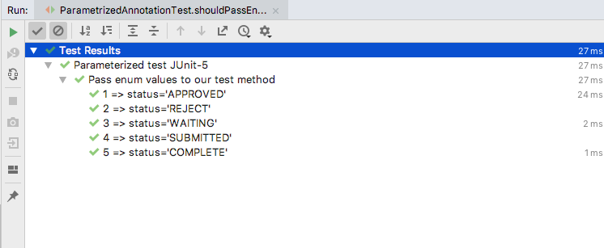

# @JUnit 5 Annotations

In this section we will see the basic JUnit 5 annotations. If you are familier with JUnit 4, 
here you can notice some of the annotations changed in JUnit 5.

All the core annotations are located in ```org.junit.jupiter.api``` package in the ```junit-jupiter-api```.

### Basic annotations

  | Annotation  | Description|
  | ------------- | ------------- |
  | **@Test**  | This annotation denotes that a method is a test method. Unlike JUnit 4’s @Test annotation, this annotation does not declare any attributes.  |
  | **@DisplayName**  | Declares a custom display name for the test class or test method.   |
  | **@BeforeEach** | Denotes that the annotated method should be executed before each test. Exactly same as JUnit 4’s **@Before**.|
  | **@AfterEach** | Denotes that the annotated method should be executed after each test. Exactly same as JUnit 4’s **@After**.|
  | **@BeforeAll** | Denotes that the annotated method should be executed before all test methods in the current class. Exactly same as JUnit 4’s **@BeforeClass**. Such methods must be **static** (unless the “per-class” test instance lifecycle is used). |
  | **@AfterAll** | Denotes that the annotated method should be executed after all @Test, @RepeatedTest, @ParameterizedTest, and @TestFactory methods in the current class; analogous to JUnit 4’s **@AfterClass**. It must be static (unless the “per-class” test instance lifecycle is used).
  
Based on these basic annotations, lets see one running example: [LifecycleJUnit5Test.java](LifecycleJUnit5Test.java)

JUnit Jupiter allows @Test, @RepeatedTest, @ParameterizedTest, @TestFactory, 
@TestTemplate, @BeforeEach, and @AfterEach to be declared on interface default methods. 

**@ParameterizedTest**:
Denotes that a method is a parameterized test. Parameterized tests make it possible to run a test multiple times with different arguments.
They are declared just like regular @Test methods but use the @ParameterizedTest annotation instead.

**Must declare at least one source that will provide the arguments for each invocation and then consume the arguments in the test method.**

### How to write parametrized tests

If our test method takes only one method parameter that is either a String or a primitive type supported by the 
**```@ValueSource```** annotation (int, long, or double), we can write a parameterized test with JUnit 5 by following these steps:

1. Add a new test method to our test class and ensure that this method takes a String object as a method parameter.
2. Configure the display name of the test method.
3. Annotate the test method with the @ParameterizedTest annotation. This annotation identifies parameterized test methods.
4. Provide the method parameters that are passed to our test method. Because our test method takes one String object as
 a method parameter, we can provide its method parameters by annotating our test method with the @ValueSource annotation.


After we have added a new parameterized test to our test class, its source code looks as follows:


```
    @DisplayName("Should pass a non-null message to our test method")
    @ParameterizedTest
    @ValueSource(strings = {"Hello", "World", "example"})
    void shouldVerifyStringOfSizeAsMethodParameter(String param) {
        assertTrue(param.length() <= 5, "Parameter should be of length smaller or equal to 5");
    }

```
                                      
   

### Customizing the Display Name of Each Method Invocation

Set the value of the **```@ParameterizedTest````** annotation’s name attribute.
This attribute supports the following placeholders:

   * **{index}**: The index of the current invocation. Note that the index of the first invocation is one.
   * **{arguments}**: A comma separated list that contains all method parameters.
   * **{ i }**: The actual method parameter (i specifies the index of the method parameter). 
   Note that the index of the first method parameter is zero.
   
   
Let’s provide a custom display name to our test method. This display name must display the index of the current invocation and the provided method parameter. 
After we have configured the custom display name of each method invocation, the source code of our test class looks as follows: 

```
    @DisplayName("Should pass a string of size equal to 5 to our test method with each invocation name")
    @ParameterizedTest(name = "{index} => message=''{0}''")
    @ValueSource(strings = {"Hello", "World", "example"})
    void shouldVerifyStringOfSizeAsMethodParameterWIthInvocationName(String param) {
        assertTrue(param.length() <= 5, "Parameter should be of length smaller or equal to 5");
    }

```  

                             


### Using Argument Sources

**```@ValueSource```** annotation is simplest argument source that is supported by JUNIT 5. 
However, Junit 5 support other argument sources as well. All supported argument sources are configured by 
using annotations found from [prg.junit.jupiter.params.provider](https://junit.org/junit5/docs/current/api/org/junit/jupiter/params/provider/package-summary.html)


### Let´s see how we can use more complex argument sources provided by JUnit 5

 **Passing Enum values to our parametrized test** 

If our parameterized test takes one enum value as a method parameter, we have to annotate our test method with the 
```@EnumSource`` annotation and specify the enum values which are passed to our test method.`

```
    enum Status {
        APPROVED,
        REJECT,
        WAITING,
        SUBMITTED,
        COMPLETE;
    }

    @DisplayName("Pass enum values to our test method")
    @ParameterizedTest(name = "{index} => status=''{0}''")
    @EnumSource(Status.class)
    void shouldPassEnumValuesAsMethodParameter(Status status) {
        assertFalse(status.toString().equalsIgnoreCase("PENDING"));
    }
    
```




**Note**: To specify enum values that are passed to test method, you can specify the enum values by setting value of 
**``` @EnumSource ```** annotation´s names attribute.

```
        @DisplayName("Should pass only the specified enum value as a method parameter")
        @ParameterizedTest(name = "{index} => status=''{0}''")
        @EnumSource(value = Status.class, names = {"APPROVED"})
        void shouldPassEnumValueAsMethodParameter(Status status) {
            Status expStatus = Status.APPROVED;
            assertEquals(expStatus,status);
        }
    
```


* **Passing Method Parameters by Using the CSV Format**:
To pass multiple method parameters to our parameterized test and the provided test data is used by only one test method
 (or a few test methods), we can configure our test data by using the **```@CsvSource```** annotation.
 
  Configure the test data by using an array of String objects.
  
   * One String object must contain all method parameters of one method invocation.
    
   * The different method parameters must be separated with a comma.
     
   * The values found from each line must use the same order as the method parameters of our test method.


```
    @DisplayName("Pass params using CsvSource")
    @ParameterizedTest(name = "{index} => input={0}, expected={1}")
    @CsvSource(value = {"test:test", "tEst:test", "Java:java"}, delimiter = ':')
    void toLowerCase_ShouldGenerateTheExpectedLowercaseValue(String input, String expected) {
        String actualValue = input.toLowerCase();
        assertEquals(expected, actualValue);
    }
```


* **Loading test data from CSV file**

Instead of passing the CSV values inside the code, we can refer to an actual CSV file.

For example, we could use a CSV file like:
     
    input,expected
    test,TEST
    tEst,TEST
    Java,JAVA
    
  
 We can load the CSV file and ignore the header column with **```@CsvFileSource```**: 
 
 ```
     @DisplayName("Should pass the method parameters provided by the test-data.csv file")
     @ParameterizedTest(name = "{index} => input={0}, expected={1}")
     @CsvFileSource(resources = "/TestData.csv", numLinesToSkip = 1)
     void toUpperCase_ShouldGenerateTheExpectedUppercaseValueCSVFile(String input, String expected) {
         String actualValue = input.toUpperCase();
         assertEquals(expected, actualValue);
     }
 ```
 
 
 
* **Using Factory method**: 
If all the parameterized tests which needs parameters are from same test class and 
logic to create method parameters is not too complex, you can create these method parameters by using a factory method.

Rules to create static factory method:

1. Method must not take any method parameters.
2. Factory method must return a ```Stream, Iterable, Iterator, or an array of Arguments objects```.
3. An Argument object must contain all method parameters of a single test method invocation.
4. Create new Arguments object by invoking static ``` of() ``` method of the Argument interface. Method parameters provided to this are passed to test method 
   * Factory method must be static only if we use the default lifecycle configuration.
   * Factory method can also return a Stream that contain primitive types.
  
Must ensure that its return value is used when JUnit 5 determines the method parameters of our parameterized test. 
We can do this by annotating our test method with the **```@MethodSource```** annotation. 
When we do this, we must remember to configure the name of the factory method. 
```
    @DisplayName("Should pass the method parameters provided by factory method")
    @ParameterizedTest
    @MethodSource("provideStringsForIsBlank")
    void isBlankShouldReturnTrueBlankStrings(String input, boolean expected) {
        assertEquals(expected, input.isEmpty());
    }

    private static Stream<Arguments> provideStringsForIsBlank() {
        return Stream.of(
                Arguments.of("", true),
                Arguments.of("not blank", false)
        );
    }

```


* **Using Customer ArgumentsProvider**

If the test methods that use our test data are found from different test classes or the logic which creates the required test data is so complex that we don’t want to add it to our test class,
we have to create a custom ArgumentsProvider.

We can do this by creating class that implements the ArgumentsProvider interface. After we have created this class, 
we have to implement the provideArguments() method that returns a Stream of Arguments objects. 
When we create the returned Stream, we must follow these rules:

1. An Arguments object must contain all method parameters of a single test method invocation.
2. We can create a new Arguments object by invoking the static of() method of the Arguments interface.
The method parameters provided to the of() method are passed to our test method when it is invoked by JUnit 5.
That’s why the provided method parameters must use the same order as the method parameters of our test method.


**First**, create ArgumentsProvider class:

```
    public class CustomArgumentProvider implements ArgumentsProvider {
    @Override
    public Stream<? extends Arguments> provideArguments(ExtensionContext extensionContext) throws Exception {
        return Stream.of(
                Arguments.of("", true),
                Arguments.of("not blank", false)
        );
    }
}

```

**Second**, configure created ArgumentsProvider by annotation test emthod with **``` @ArgumentsSource```** annotation.

 ```
     @DisplayName("Should pass the method parameters provided by Argument Provider")
     @ParameterizedTest
     @ArgumentsSource(CustomArgumentProvider.class)
     void shouldReturnTrueForBlankStringsWithCustomProvider(String input, boolean expected) {
         assertEquals(expected, input.isEmpty());
     }
 ```
 
  Check [@ParameterizedTest example](examples/ParametrizedAnnotationTest.java)