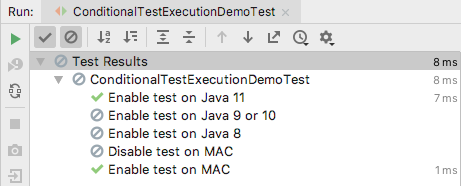
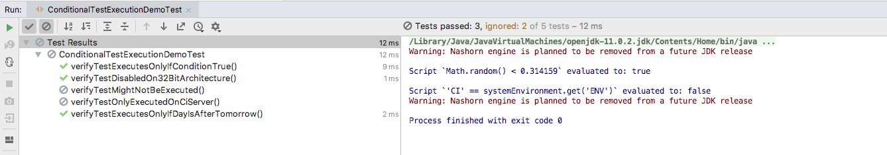

# JUnit 5 Condition Test Execution

[ExecutionCondition](https://junit.org/junit5/docs/current/api/org/junit/jupiter/api/extension/ExecutionCondition.html) 
defines the extension API for programmatic, conditional test execution.

An ```ExecutionCondition`` is evaluated for each container (e.g., a test class) to determine if all the tests it contains 
should be executed based on the supplied ExtensionContext.`
 
Similarly, an ```ExecutionCondition`` is evaluated for each test to determine if a given test method should be executed `
based on the supplied ExtensionContext.

When multiple ExecutionCondition extensions are registered, a container or test is disabled as soon as one of the 
conditions returns disabled. Thus, there is no guarantee that a condition is evaluated because another extension might
have already caused a container or test to be disabled. 

In other words, the evaluation works like the short-circuiting boolean OR operator.

**Note**: Each of the conditional annotations listed in the following sections can only be declared once on a given test interface, test class, or test method. If a conditional annotation is directly present, indirectly present, or meta-present multiple times on a given element, 
only the first such annotation discovered by JUnit will be used; any additional declarations will be silently ignored.


## Operating System Conditions

A container or test may be enabled or disabled on a particular operating system via the 
**```@EnabledOnOs```** and **```@DisabledOnOs```** annotations.`


```
@EnabledOnOs(OS.MAC)
public class ConditionalTestExecutionDemoTest {

    @DisplayName("Enable test on MAC")
    @Test
    @EnabledOnOs(OS.MAC)
    void verifyTestEnabledOnlyOnMac(){
        assertEquals(6, (3+3), "Sum should be 6");
    }

    @Test
    @DisabledOnOs(OS.MAC)
    void verifyTestDisabledOnWindows(){
        assertEquals(6, (3+3), "Sum should be 6");
    }
}

```

## Java Runtime Environment Conditions
A container or test may be enabled or disabled on a particular version of the Java Runtime Environment 
(JRE) via the **```@EnabledOnJre```** and **``@DisabledOnJre annotations```**.

```
@DisplayName("Enable test on Java 8")
    @Test
    @EnabledOnJre(JRE.JAVA_8)
    void verifyTestEnabledOnJre8() {
        assertEquals(6, (3 + 3), "Sum should be 6");
    }

    @DisplayName("Enable test on Java 9 or 10")
    @Test
    @EnabledOnJre({JRE.JAVA_9, JRE.JAVA_10})
    void verifyTestEnabledOnJre9Or10() {
        assertEquals(6, (3 + 3), "Sum should be 6");
    }

    @DisplayName("Enable test on Java 11")
    @Test
    @EnabledOnJre(JRE.JAVA_11)
    void verifyTestEnabledOnJre11() {
        assertEquals(6, (3 + 3), "Sum should be 6");
    }
    
```



## System Property Conditions

A container or test may be enabled or disabled based on the value of the named JVM system property via the 
**```@EnabledIfSystemProperty```** and **``@DisabledIfSystemProperty```** annotations. 
The value supplied via the matches attribute will be interpreted as a regular expression.`

```
    @Test
    @EnabledIfSystemProperty(named = "os.arch", matches = ".*64.*")
    void verifyTestEnabledOnlyOn64BitArchitecture(){
        assertEquals(6, (3 + 3), "Sum should be 6");
    }

    @Test
    @EnabledIfSystemProperty(named = "ci-server", matches = "true")
    void verifyTestDisabledOnCiServer(){
        assertEquals(6, (3 + 3), "Sum should be 6");
    }
```


## Script-based conditions

JUnit Jupiter provides the ability to either enable or disable a container or test depending on the evaluation of
a script configured via the **```@EnabledIf```** or **```@DisabledIf```** annotation. Scripts can be written in JavaScript, Groovy, 
or any other scripting language for which there is support for the Java Scripting API.


```
@Test
    @EnabledIf("2*3 == 6")                            //Static JAVASCRIPT expression
    void verifyTestExecutesOnlyIfConditionTrue() {
        assertEquals(6, (3 + 3), "Sum should be 6");
    }

    @Test
    @DisabledIf("Math.random() < 0.314159")           // Dynamic JavaScript expression.
    void verifyTestMightNotBEExecuted() {
        assertEquals(6, (3 + 3), "Sum should be 6");
    }

    @Test                                             // Regular expression testing bound system property.
    @DisabledIf("/32/.test(systemProperty.get('os.arch'))")
    void disabledOn32BitArchitecture() {
        assertFalse(System.getProperty("os.arch").contains("32"));
    }

    @Test
    @EnabledIf("'CI' == systemEnvironment.get('ENV')")
    void onlyOnCiServer() {
        assertTrue("CI".equals(System.getenv("ENV")));
    }

    @Test                                           // Multi-line script, custom engine name and custom reason.
    @EnabledIf(value = {
            "load('nashorn:mozilla_compat.js')",
            "importPackage(java.time)",
            "",
            "var today = LocalDate.now()",
            "var tomorrow = today.plusDays(1)",
            "tomorrow.isAfter(today)"
    },
            engine = "nashorn",
            reason = "Self-fulfilling: {result}")
    void verifyTestExecutesOnlyIfDayIsAfterTomorrow() {
        LocalDate today = LocalDate.now();
        LocalDate tomorrow = today.plusDays(1);
        assertTrue(tomorrow.isAfter(today));
    }
    
```

