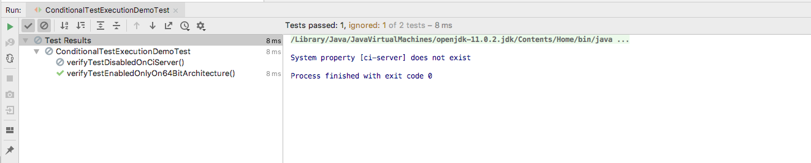

# JUnit 5 Condition Test Execution

[ExecutionCondition](https://junit.org/junit5/docs/current/api/org/junit/jupiter/api/extension/ExecutionCondition.html) 
defines the extension API for programmatic, conditional test execution.

An ```ExecutionCondition``` is evaluated for each container (e.g., a test class) to determine if all the tests it contains 
should be executed based on the supplied ExtensionContext.
 
Similarly, an ```ExecutionCondition``` is evaluated for each test to determine if a given test method should be executed 
based on the supplied ExtensionContext.

When multiple ExecutionCondition extensions are registered, a container or test is disabled as soon as one of the 
conditions returns disabled. Thus, there is no guarantee that a condition is evaluated because another extension might
have already caused a container or test to be disabled. 

In other words, the evaluation works like the short-circuiting boolean OR operator.

**Note**: Each of the conditional annotations listed in the following sections can only be declared once on a given test interface, test class, or test method. If a conditional annotation is directly present, indirectly present, or meta-present multiple times on a given element, 
only the first such annotation discovered by JUnit will be used; any additional declarations will be silently ignored.


## Operating System Conditions

A container or test may be enabled or disabled on a particular operating system via the 
**```@EnabledOnOs```** and **```@DisabledOnOs```** annotations.


```
@EnabledOnOs(OS.MAC)
public class ConditionalTestExecutionDemoTest {

    @DisplayName("Enable test on MAC")
    @Test
    @EnabledOnOs(OS.MAC)
    void verifyTestEnabledOnlyOnMac(){
        assertEquals(6, (3+3), "Sum should be 6");
    }

    @Test
    @DisabledOnOs(OS.MAC)
    void verifyTestDisabledOnWindows(){
        assertEquals(6, (3+3), "Sum should be 6");
    }
}

```

## Java Runtime Environment Conditions
A container or test may be enabled or disabled on a particular version of the Java Runtime Environment 
(JRE) via the **```@EnabledOnJre```** and **```@DisabledOnJre annotations```**.

```
@DisplayName("Enable test on Java 8")
    @Test
    @EnabledOnJre(JRE.JAVA_8)
    void verifyTestEnabledOnJre8() {
        assertEquals(6, (3 + 3), "Sum should be 6");
    }

    @DisplayName("Enable test on Java 9 or 10")
    @Test
    @EnabledOnJre({JRE.JAVA_9, JRE.JAVA_10})
    void verifyTestEnabledOnJre9Or10() {
        assertEquals(6, (3 + 3), "Sum should be 6");
    }

    @DisplayName("Enable test on Java 11")
    @Test
    @EnabledOnJre(JRE.JAVA_11)
    void verifyTestEnabledOnJre11() {
        assertEquals(6, (3 + 3), "Sum should be 6");
    }
    
```


## System Property Conditions

A container or test may be enabled or disabled based on the value of the named JVM system property via the 
**```@EnabledIfSystemProperty```** and **```@DisabledIfSystemProperty```** annotations. 
The value supplied via the matches attribute will be interpreted as a regular expression.`

```
    @Test
    @EnabledIfSystemProperty(named = "os.arch", matches = ".*64.*")
    void verifyTestEnabledOnlyOn64BitArchitecture(){
        assertEquals(6, (3 + 3), "Sum should be 6");
    }

    @Test
    @EnabledIfSystemProperty(named = "ci-server", matches = "true")
    void verifyTestDisabledOnCiServer(){
        assertEquals(6, (3 + 3), "Sum should be 6");
    }
```




## Script-based conditions

JUnit Jupiter provides the ability to either enable or disable a container or test depending on the evaluation of
a script configured via the **```@EnabledIf```** or **```@DisabledIf```** annotation. Scripts can be written in JavaScript, Groovy, 
or any other scripting language for which there is support for the Java Scripting API.


```
@Test
    @EnabledIf("2*3 == 6")                            //Static JAVASCRIPT expression
    void verifyTestExecutesOnlyIfConditionTrue() {
        assertEquals(6, (3 + 3), "Sum should be 6");
    }

    @Test
    @DisabledIf("Math.random() < 0.314159")           // Dynamic JavaScript expression.
    void verifyTestMightNotBEExecuted() {
        assertEquals(6, (3 + 3), "Sum should be 6");
    }

    @Test                                             // Regular expression testing bound system property.
    @DisabledIf("/32/.test(systemProperty.get('os.arch'))")
    void disabledOn32BitArchitecture() {
        assertFalse(System.getProperty("os.arch").contains("32"));
    }

    @Test
    @EnabledIf("'CI' == systemEnvironment.get('ENV')")
    void onlyOnCiServer() {
        assertTrue("CI".equals(System.getenv("ENV")));
    }

    @Test                                           // Multi-line script, custom engine name and custom reason.
    @EnabledIf(value = {
            "load('nashorn:mozilla_compat.js')",
            "importPackage(java.time)",
            "",
            "var today = LocalDate.now()",
            "var tomorrow = today.plusDays(1)",
            "tomorrow.isAfter(today)"
    },
            engine = "nashorn",
            reason = "Self-fulfilling: {result}")
    void verifyTestExecutesOnlyIfDayIsAfterTomorrow() {
        LocalDate today = LocalDate.now();
        LocalDate tomorrow = today.plusDays(1);
        assertTrue(tomorrow.isAfter(today));
    }
    
```


## Conditionally disabling tests 

In Junit 4 there was ```@Ignore``` annotation which told a JUnit runner to skip the execution of that test. 

In JUnit 5, the ```@Ignore``` annotation has been replaced with ```@Disabled```. But, far from just changing the name, 
the JUnit team has also given us hooks into the test 
execution functionality allowing for easy customization on when a test should be executed. 

Let’s take a look at creating a custom ```@Disabled`` tag that will disable a test based on the operating system of 
the host machine.

The **first step** would be creating a class that implements the ```ExecutionCondition`` interface. 
Implementing evaluateExecutionCondition gives access to ExtensionContext which provides extensive information 
on the context of the test being executed; tags, display name, method, etc. 

I won’t be using it in this example, but it can provide useful information when determining
if a test should be disabled.

In this example, we will simply look up the name of the host machine’s operation system and then disable the test if the os.name matches “Mac OS X”. 
In the disabled method, the passed-in string is the reason the test is disabled. This will show up in test reports.

```
public class DisableOnMacCondition implements ExecutionCondition {
    @Override
    public ConditionEvaluationResult evaluateExecutionCondition(ExtensionContext context) {
        String osName = System.getProperty("os.name");
        if(osName.equalsIgnoreCase("Mac OS X")) {
            return ConditionEvaluationResult.disabled("Test disabled on mac");
        } else {
            return ConditionEvaluationResult.enabled("Test enabled");
        }
    }
}
```
After implementing the ExecutionCondition, we can create our own custom annotation, which is named as ```DisabledOnMac```

```
@Target({ElementType.METHOD, ElementType.TYPE})
@Retention(RetentionPolicy.RUNTIME)
@ExtendWith(DisableOnMacCondition.class)
public @interface DisabledOnMac {

}
```

With the custom annotation created,
you can annotate any test that might be problematic when it’s executed on a Mac with ```@DisabledOnMac``.

```
    @Test
    @DisabledOnMac
    void testCustomAnnotaion(){
        assertEquals(6, (3+3), "Sum should be 6");
    }
```

Being able to conditionally execute tests can be very helpful.
 
Lots of the benefits with this new functionality will come with integration tests or tests that
reference system resources which might depend heavily upon local system configurations.
 
Requiring developers to configure their systems to properly execute a test might be difficult to enforce. 
So, having the ability to conditionally skip a test when a machine isn’t configured properly to run it is much better than doing a blanket ignore or, having to deal with a failing test.

Let's move forward to pur next [topic](tagging.md)


