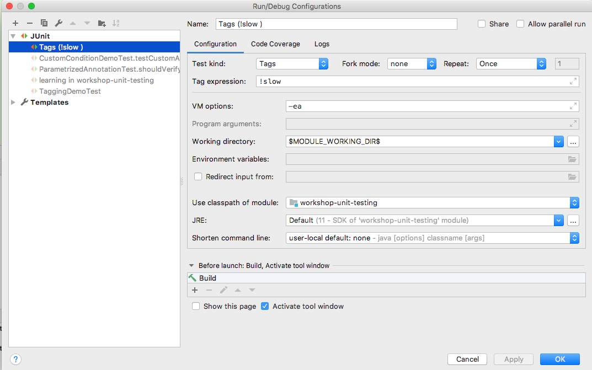

# Tagging and filtering

Most of my experience writing automated tests have been with JUnit 4; 
I have comparatively little experience TestNG. 
That said, one feature that I did like in TestNG was the relative ease of being able to place tests in groups and
execute tests by group.
JUnit 4 had ```@Category```, however its implementation was rarely used.

With the [tagging](https://junit.org/junit5/docs/current/user-guide/#writing-tests-tagging-and-filtering) 
feature, JUnit 5 takes some notes from TestNG, but also greatly improves upon it as well.


Test classes and methods can be tagged via the **```@Tag```** annotation. It can be used to 
filter testcases from test plans. It can help in create multiple different test plans for 
different environments, different use-cases or any specific requirement. 

You can execute set of tests by including only those tagged tests in test plan OR by excluding other tests from test plan.

## Syntax for Tag
1. A tag must not be null or blank.
2. A trimmed tag must not contain whitespace.
3. A trimmed tag must not contain ISO control characters.
4. A trimmed tag must not contain any of the following reserved characters.
    * , comma
    * ( ) left and right parenthesis
    * & ampersand
    * | vertical bar
    * ! exclamation point
    
    
## @Tag Annotation Usage

```
@DisplayName("Test tagging")
public class TaggingDemoTest {

    @Test
    @Tag("production")
    @Tag("fast")
    public void testCaseA(){
        assertEquals(6, (3+3), "Sum should be 6");
    }

    @Test
    @Tag("slow")
    @Tag("production")
    public void testCaseB(){
        assertEquals(9, (3*3), "Result should be 9");
    }

    @Test
    @Tag("test")
    @Tag("fast")
    public void testCaseC(){
        assertEquals(9, (3*3), "Result should be 9");
    }

    @Test
    @Tag("test")
    @Tag("slow")
    public void testCaseD(){
        assertEquals(9, (3*3), "Result should be 9");
    }

}

```

[**Code](examples/TaggingDemoTest.java)

**Filtering by tag can be done in intelliJ**: Create configuration. Mention the required tag. the filtered tests will 
not even show up in the test report. This is different from disabled, where disabled tests still show up as skipped. 



**Filtering in Maven**: 

```
<build>
        <plugins>
            <plugin>
                <groupId>org.apache.maven.plugins</groupId>
                <artifactId>maven-compiler-plugin</artifactId>
                <version>3.3</version>
                <configuration>
                    <source>${java.version}</source>
                    <target>${java.version}</target>
                </configuration>
            </plugin>
            <plugin>
                <artifactId>maven-surefire-plugin</artifactId>
                <version>${maven.surefire.plugin.version}</version>
                <configuration>
                    <excludedGroups>slow, production</excludedGroups>
                </configuration>
            </plugin>
        </plugins>
    </build>
```

Lets move to [JUnit 5 Assertions](../assertions/assertions.md)